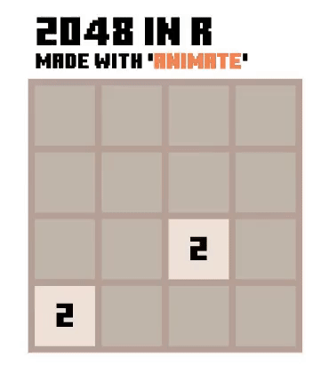
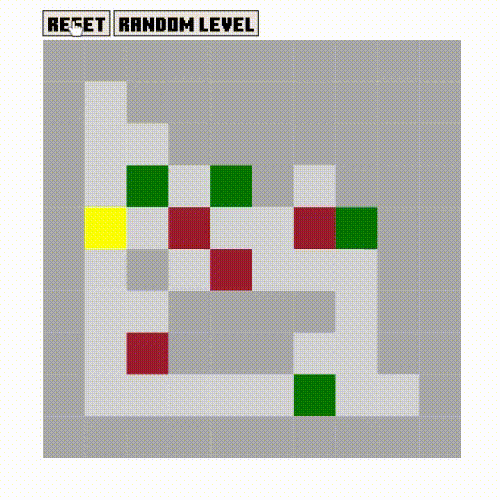

# webr-animate

This is an experiment to manually port the [animate](https://github.com/kcf-jackson/animate) R package to [webR](https://github.com/r-wasm/webr/).

The goal is to have a (partially) working version of the `animate` package in the browser until the original package can be compiled natively to WebAssembly and loaded by webR. This is a proof of concept, and not intended for production use. 

The experiment intends to show how much flexibility and fun one can have when you can use R in the browser!


## Two examples - Sokoban and 2048

Play [live demo]() here. 
- Click the folder button, select the game from the drop-down menu and source `main.R` to start the game.
- The app takes about 20-40 seconds to load for the first time.
- It is highlhy recommended to refresh the app before switching to a different example.


**2048**




**Sokoban**




## Notes


1. **Mouse and Keyboard control.** The variable `io` is reserved for the webr-animate package to capture mouse and keyboard events. The variables get updated whenever a registered event gets triggered. Here is a simple example:


    #### Mouse events

    ```
    # Setup device
    attach(device)
    new(400, 400, id = 'svg-1', root = '#plot')  # there is a div with id 'plot' in the HTML

    # Create the base plot
    par(xlim = c(0, 10), ylim = c(0, 10))  # use static range
    plot(1:10, 1:10, id = 1:10)

    # Update plot when clicked
    event('#plot', 'click', function(io) {  # the `io` argument must be present
        print(io)   # inspect the event variable
        points(1:10, sample(10), id = 1:10, transition = TRUE)
    })
    ```

    The first argument of `event` takes a CSS selector, and the second argument takes the event type (e.g. see the [Mouse events](https://developer.mozilla.org/en-US/docs/Web/API/Element#mouse_events) and [Keyboard events](https://developer.mozilla.org/en-US/docs/Web/API/Element#keyboard_events)). The third argument is a function that takes the `io` variable as its argument and performs the desired action.


    #### Keyboard events

    Using the same example, you can listen for the "Enter" key press event instead of the mouse click event:


    ```
    # Setup device
    attach(device)
    new(400, 400, id = 'svg-1', root = '#plot')  # there is a div with id 'plot' in the HTML

    # Create the base plot
    par(xlim = c(0, 10), ylim = c(0, 10))  # use static range
    plot(1:10, 1:10, id = 1:10)

    # Update plot when "Enter" is pressed
    event('#plot', 'keypress', function(io) {  # the `io` argument must be present
        if (io$event$key == 'Enter') {
            points(1:10, sample(10), id = 1:10, transition = TRUE)
        }
    })
    ```


2. **Differences between `animate` and `webr-animate`.** In `webr-animate`, you initialise the device with:
    ```
    device$new(width = 600, height = 600, id = "svg-1", root = "#plot")
    attach(device)
    ```

    unlike the case in `animate`: 
    ```
    device <- animate$new(width = 600, height = 600, id = "svg-1", root = "#plot")
    attach(device)
    ```

    **Remember that the `device` and `io` variables are reserved**, so please do not write to them. 
